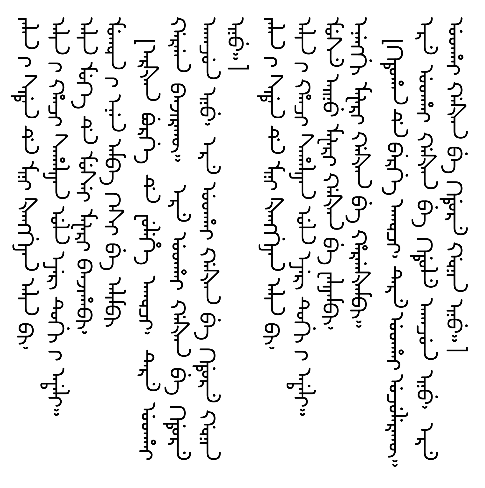

> “你的字体圆吗？”
>
> “满圆的。”
>
> “到底是圆还是不圆？”
>
> “满圆。”



```tex
\noindent jalan~-i siden~de mini xanggiyan alin bi,\\
alin~-i hanqi sahaliyan ula eyer tugi~-i adali.\\
alin muke~de musei mafari banjihabi,\\
mukvn~-i enen amba kesi~be alimbi

``arxan burge~de fulehe akvqi, tere uthai gargan banjirakv. ere uthai gaxan~be kidure akaqun inu, ere uthai gaxan~be kidure gvnin inu.''

\noindent jalan~-i siden de mini xanggiyan alin bi,\\
alin~-i hanqi sahaliyan ula eyer tugi~-i adali.\\
muse ainu mafari gaxan~be waliyambi,\\
enenggi mafari gaxan~be hargaxambi.

``kituhan~de berge akvqi, tere uthai uqulerakv. ere uthai gaxan be kidule akaqun inu, ere uthai gaxan~be kidure gvnin inu.''
```

满圆体（ᠮᠠᠨ ᠶᡠᠸᠠᠨ ᡨ᠋ᡳ; Modern manJu Round, MJR）是一款开源满文美术字体。致力于从以下三个方向来优化满文字体设计：

- 尽量不借助辅助字符来正确显示字母变体；
- 利用尽量少的字体特性方便拓展制作；
- 在保持可读性的前提下尽力简化笔形。

从字体层面，满圆体去除了满文抄本、刻本中古朴的笔锋，合并了一些不影响识读的元素，用尽量少元素来表达纷繁复杂的满文字符。字体目前支持满文、锡伯文常用字符和标点符号。

[技术文档](document/技术文档.md) |  [Q&A](document/Q&A.md) |  [更新日志](document/更新日志.md) 

## 下载

下载请见 ttf 下的最新版本，其中带有 test 后缀的是还未发布的版本。
