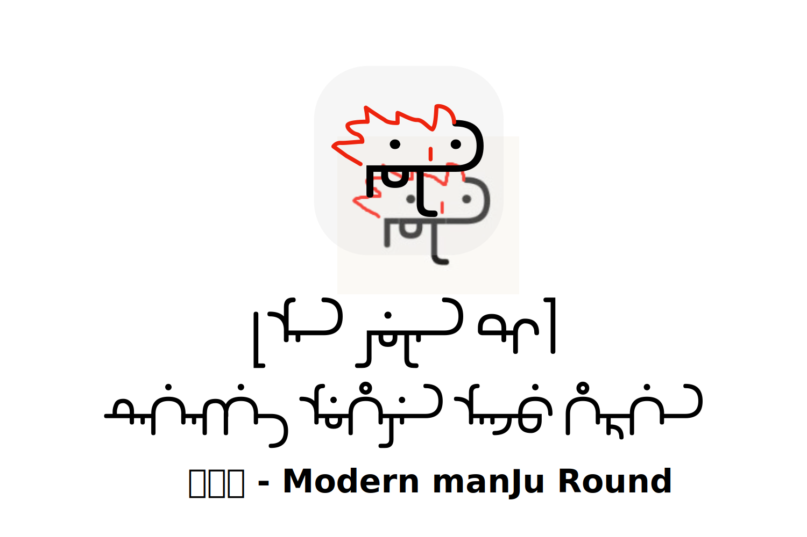

> “你的字体圆吗？”
>
> “满圆的。”
>
> “到底是圆还是不圆？”
>
> “满圆。”

满圆体是一款在保持可读性的前提下尽力简化笔形的满文美术字体，去除了满文抄本、刻本中古朴的笔锋，合并了一些不影响识读的元素，用尽量少元素来表达纷繁复杂的满文字符。字体目前支持满文、锡伯文常用字符和标点符号。


```tex
``manju gisun serengge, manju halangga niyalmai fulehe da yaya we bahanarakvqi ojorakvngge kai, adarame seqi, muse jabxan de wesihun jalan -i ayan suwayan manju ofi, aika manjurame bahanarakv, niyalma be aqaha dari, fonjiha \nolinebreak de, angga gahvxara yasa xarinjara oqi, ereqi giqukengge biu ereq=====i fanqaqukangge ge=====li bi===============o::''

tangsu: batu si ainambi ni.

batu: bi jing bithe hvlame bi. taqibusi muse be xu bithe be labdu hvlabumbi, uttu ofi, bi jing <<ilan gurun -i bithe>> be hvlamebi.

tangsu: mini tere dabteli <<hari poter>> be si sabuhau.

neh'v, dvmbi, hv, h'v. h h' h''. t'' d'' t d 
```

下载请见ttf下的最新版本，其中带有test后缀的是还未发布的版本

更新日志：

0.1/0.2

- 字形绘制

0.3

- -i的支持
- 新增对单、双、四qik，冒号、引号的支持

0.4beta

- 调整字号和行距
- 词首、词中形字符增加尖角，避免白缝
- 对于kgh的阴性词形和k'v g'v h'v的支持（需要对U+180B即FVS1的适配）
  - k'v g'v h'v采用U+180C
- g'.init显示错误
- l.fina显示错误
- 诸如᠊ᠸᠠᠶ᠊形式下字符碰撞的问题
  - 当f/w和y之间只有一个字符时，采用更长的y
- x有些跟k‘混淆，需要把左边一撇适当分离

## 已知问题（打勾表示test后缀版本中已解决）

- [ ] 无标点符号和ASCII支持
- [ ] r需要调整，-ri词尾形过于拥挤、hergen的r-g过于拥挤
- [x] Tu du 独立型显示错误
- [x] 曲线的方向不统一，转化为形状时会出现空档（软件直接压平，若要调整再从从0.4beta粘）
- [ ] 补全latex映射文件
- [ ] ~~所有转角统一为圆角，涉及ᠪᠣ等复杂情况，搁置~~


