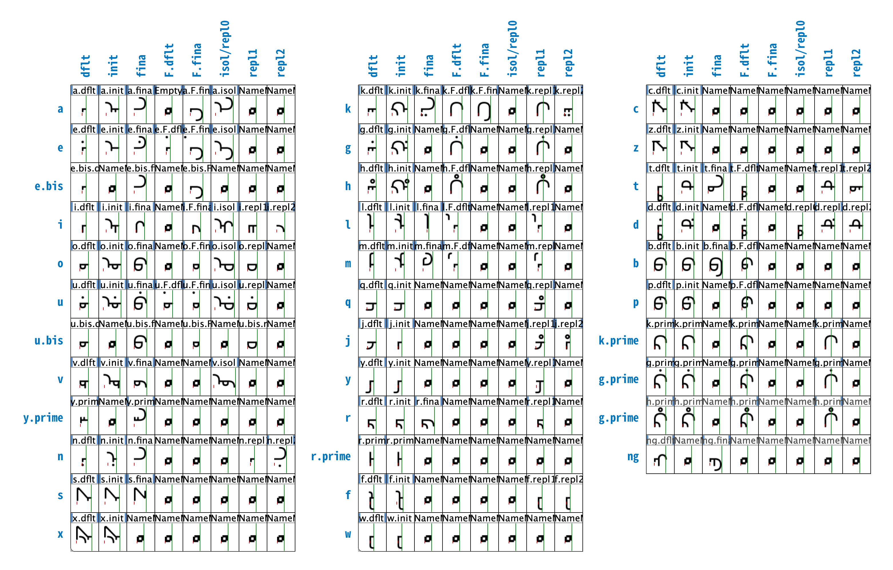
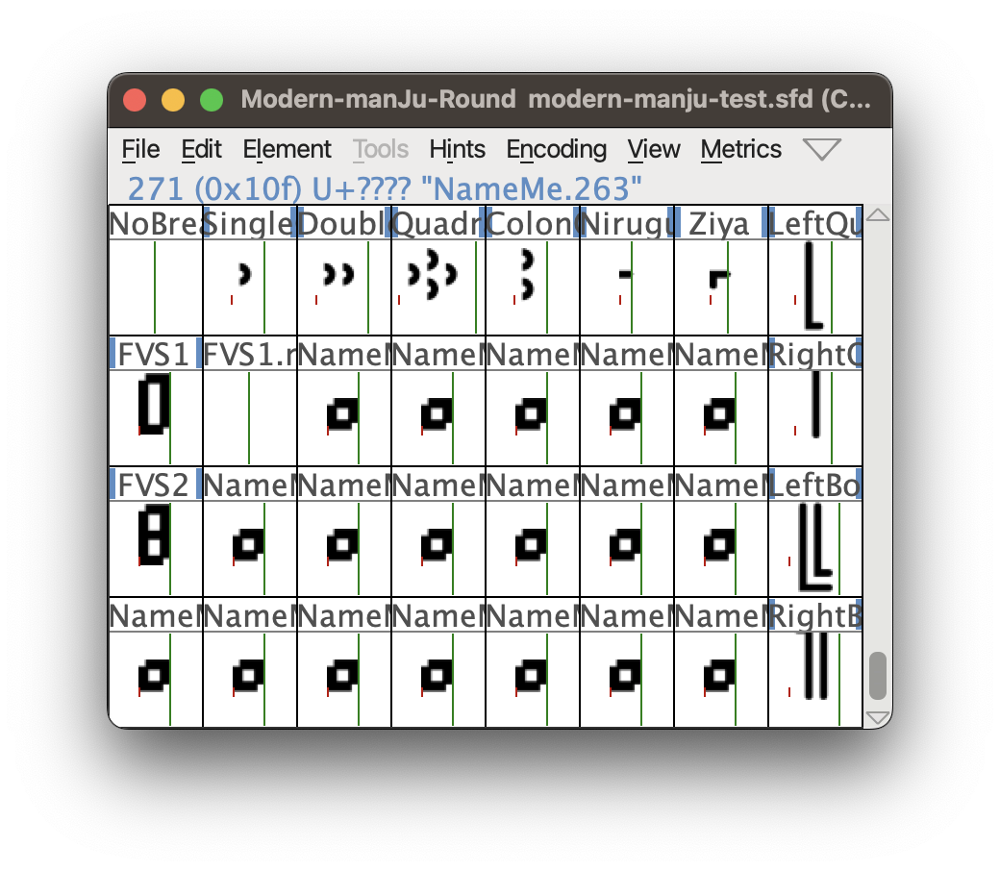
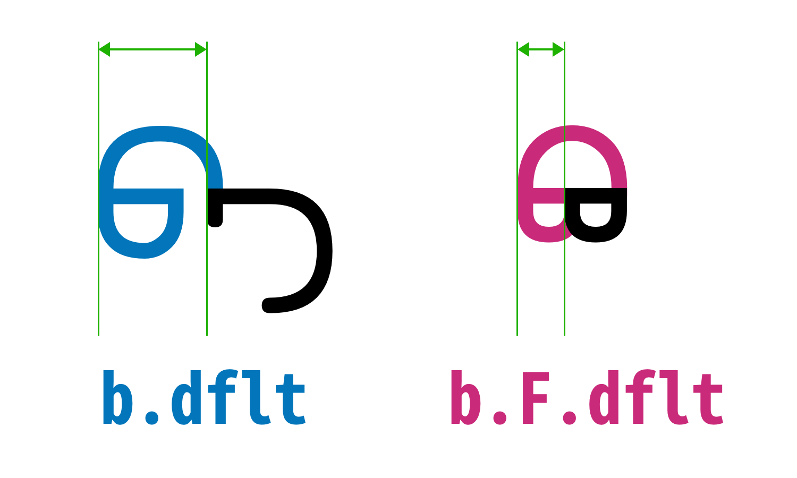
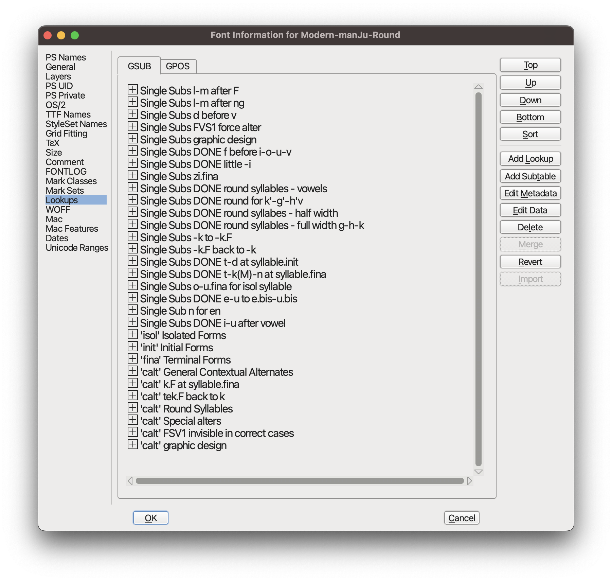

# 满圆体技术文档

满圆体致力于将自然行文中最常见的字母变体全部交由字体特性处理，并试图尽量减少各种特性的规则数量。

满圆体使用开源字体设计软件 FontForge 制作。考虑到打包后 glyphs 和 lookups 表会被重新以序号命名，本文档公开其设计思路。希望帮助大家理解其背后的设计思路。

## 转写约定

本文档使用太清转写，且不区分上下引号，统一使用直引号 '。

## 字形设计

满圆体的整体设计思路是尽量简化设计流程。遵循这个思路，观察满文字母，可以发现，满文字母在一定程度上可以做出归并，将不会引起歧义的字符合并为相同字形，并尽量简化字形的复杂程度。

具体地，满圆体的字母设计做出了以下简化：

* 取消字牙的倾斜角度，全部水平放置；
* 除非必要，否则所有字干（连接符）出现在字母后；
* 相似的字形尽量复用设计元素，如直线、圆弧等；
* 对于没有必要区分的对立关系，不再区分。

这种设计思路使得满圆体的字形形态与满文识读学习时大家所习惯的不同，举例如下。

* 学习满文时，a 的词中型往往写作“字干-短牙-字干”结合的形式，但满圆体则直接设计为“短牙-字干”结合的形式。这是因为，字母 a 表示为词中型时，其前面一定有另一个字母以字干结尾，因此不必重复绘制字干。
* 学习满文时，j 的词头型写作向下倾斜的长牙，但满圆体则直接设计为水平的长牙。这是因为，作为元音的长牙不会出现在词头，因此词头出现长牙时，它只可能属于辅音字母 j，不会引起歧义，没有必要倾斜。

基于这种设计思路，满圆体没有沿用“独立型-词头型-词中型-词尾型”的字母设计思路，而是将字母形态重新划分为以下三大类：

* 默认型（带有词头、词尾、独立变体）；
* “阴性”（带有词尾变体）；
* 替换型。

作为默认型，是指不加干涉时的字母形态。

所谓“阴性”，是指因辅音与元音搭配不同而导致的变体。我注意到一些声音认为“阴性”的命名不妥，因此使用该词时请打引号。注意，圆头辅音字母虽然在识读上没有变形，但配合不同的元音字母，需要独立分别调用半宽和全宽两种变体，符合此处“阴性”的定义。见圆头字母的处理

所谓替换型，是指“阴性”无法涵盖的更多变体，具体如下：

* 借用有独立编码的其他字母来作为字母变形，例如 fu 中的 f 借用了 w 的写法；
* 因变体不具有普适性而不得不拓展的字形，如 i 位于元音字母后的双长牙形式；
* 因具有独立编码而不适合被称为“阴性”的字形，如 q'；
* 字母变形偏多，而“阴性”不够用的情况下，作为扩展字形，如 t 的词头型和词中型均有出头和不出头两种变体，需要启用替换型字形来容纳；
* 在码位充足的情况下，出于美观目的而设计的字形。

## 字形顺序和命名规律

为了方便快速定位字符，满圆体的字形（glyph）并未按照 Unicode 顺序排列。字体中，先排列字母，后排列标点符号。

### 字母

字母区每 8 个字形为一组。一组字符包含一个满文字母的各种变体。满文字母依以下顺序排列：

* 元音字母 a、e（占 2 行）、i、o、u（占 2 行）、v；
* 音节 cy'、sy' 中的字母 y'；
* 辅音字母 n、s、x、k、g、h、l、m、q（包含 q'）、j（包含 j'）、y、r、r'、f、w、c、z、t、d、
* 纯圆头辅音字母 b、p、k'、g'、h'；
* 仅用于音节末的辅音字母 ng。

注意，字母 e 和 u 占 2 行；q 和 q' 占同一行，j 和 j' 占同一行。

字形命名中，将 ' 写作.prime；对于占 2 行的字母，第二行加后缀.bis。

> **为什么？**
>
> 字母 e 和 u 占 2 行，是因为它们都带点和不带点的形态。不带点的 e 的变体规则与 a 类似，不带点的 u 的变体规则与 o 类似。使用占两行的设计，可
>
> q 和 q'、j 和 j' 分别只占一行，是因为它们的变体和变体规则都很少。

每组字形内部的 8 个字形从左至右按以下顺序排列，并带有对应后缀：

* 默认型（.dflt）；
* 词头变体（.init）；
* 词尾变体（.fina）；
* “阴性”默认型（.F.dflt）；
* “阴性”词尾变体（.F.fina）；
* 独立变体（.isol）或替换型 0（.repl0）
* 替换型 1（.repl1）；
* 替换型 2（.repl2）。

注意，独立变体和替换型 0 占同一列。

> **为什么？**
>
> 因为字母是否占用替换型 0 和是否占用独立变体是互斥的。

未使用的空字形以空位符（形似缺角方框）表示，不单独命名，供后续扩展使用。

通过下表，可以快速确定字形在字体中的位置和命名：

### 码位

对于字母，满圆体仅为不带变体的默认形字母和标点分配对应字母的 Unicode 码位。仅有的特殊情况是 q.repl1 和 j.repl1。它们实际上对应 q' 和 j'，只不过被归并到 q 和 j 中，严谨的命名应当是 q.prime.dflt 和 j.prime.dflt，因此带有 Unicode 码位。

### 特殊符号

满圆体为特殊符号预留了 32 个字形位置。其中，已经纳入的字形和码位如下：

* 零宽空格（U+202F）；
* 单启壳（U+1808）；
* 双启壳（U+1809）；
* 四启壳（U+1805）；
* 冒号（U+1804）；
* 字干（U+180A）；
* 字牙（U+1807）；
* 自由变体选择符 1（FVS1；U+180B）；
* 自由变体选择符 1 替换型 1；
* 自由变体选择符 2（FVS2；U+180C）；
* 开引号（U+2018，占用‘的码位）；
* 关引号（U+2019，占用’的码位）；
* 开书名号（U+201C，占用“的码位）；
* 关书名号（U+201D，占用”的码位）。

其余字形留空供拓展使用。

圆字母的处理

所谓圆字母，是指与 o、u、v 等元音搭配时，需要将元音的圆形部分包裹进本身的辅音字母。

满圆体不单独为圆字母组成的音节设计合字，而为所有圆字母设计半宽字形和全宽字形。半宽字形用于与 o、u、v 等元音相连。这样不需为圆字母后接的大部分元音字母设计特殊字形。

圆字母后接 l、m 等字牙右侧带有笔画的字母时，右侧的笔画会移至圆字母右侧；后接 u 等带点的字母时，点会移至圆字母右侧。因此，需要为其后的字母设计特殊字形。

## 美术设计

虽然满圆体不强调字母的美术设计，但对于一些看起来不美观的情况，仍然设计了特殊变体来改善。具体如下：

* 为字母 o、u、u.bis 设计圆圈较大的词尾变体 o.repl1、u.repl1、u.bis.repl1，用于在独立型音节中使得整体协调。
* 为字母 y 设计前有字干的形态 y.repl1，用于在 fay 等拼写中防止与前面字母重叠。
* 将字母 ng 默认型的圆圈设计得比圆字母的圆圈更小以改善阅读节奏跳跃的问题，并对应地为 l、m 设计右侧笔画更长的形态 l.repl1、m.repl1，使 ngl、ngm 等拼写正确衔接。
* 为字母 r 设计较短小的形态 r.repl1，用于在 ra、re 等拼写中防止视觉上字干过长。

## 字形变体规则

这是满圆体的 Lookups 表：

前面的一系列以 Single Subs 开头的内容是在规定哪个字形可以变成哪个字形。从以 'isol' 开头的一项开始，则规定在什么情况下变形、应用哪条 Single Subs 规则变形。

注意，但这似乎是一种不规范的做法——根据[微软的文档](https://learn.microsoft.com/en-us/typography/opentype/otspec184/features_ae#tag-calt)，'calt' 似乎更应该搭配 Chaining Contextual Substitution 而不是 Single Substitution 使用。我拆解了几个满文字体，都是基于这样先 Single Subs 再 'calt' 的逻辑。完大蛋，我不会了😢。如果你了解这方面的知识，请教教我。

变形规则应用前，默认输入的字母（除 q'、j' 外）皆为默认型字形，随后从 'isol' 开始依次向下执行变形规则。

变形规则遵循先通用、再特殊，先细节、后整体的思路。先处理特殊情况较少或没有特殊情况的通用变体规则，再针对特殊情况做进一步处理；针对特殊情况的处理，则先将细碎的情况罗列清楚后，再用整体变形规则兜底。这样做的好处是，字母变体可以尽量围绕默认型展开，变形规则的嵌套层数不会过多。

具体变形规则见[变形规则表](变形规则表.md)。
